# Archive of Your Own

A privacy-focused native reader for [Archive of Our Own](https://archiveofourown.org) on iOS and iPad. All traffic is routed through Tor. AO3 content is parsed into structured data and rendered as native SwiftUI views — no web views, no tracking, no compromise.

<p align="center">
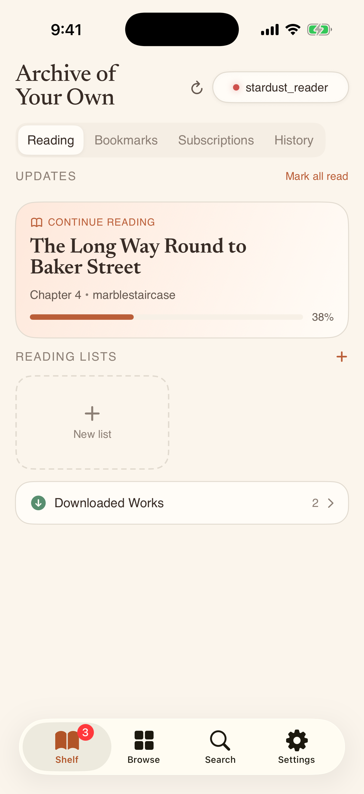
&nbsp;&nbsp;
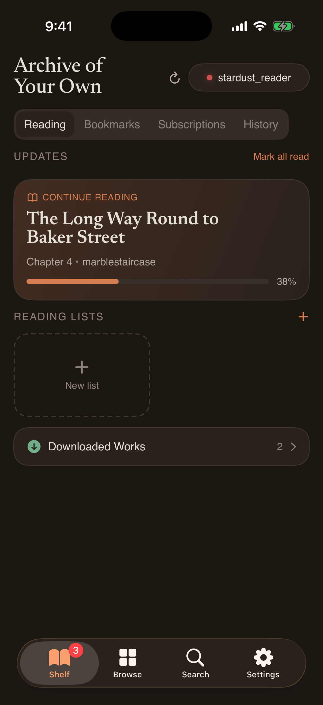
</p>

## Why this exists

AO3 has no official app and no API. Reading on mobile means a browser, which means ads, trackers, and your IP address tied to every page you visit. This app gives you a proper reading experience with real privacy: embedded Tor routing, encrypted local storage, and zero third-party dependencies.

## Reading

Chapters are parsed from HTML into a structured content tree in Rust and rendered with native SwiftUI typography. Choose from serif and sans-serif reading fonts, adjust size and density, and read comfortably in any theme.

<p align="center">
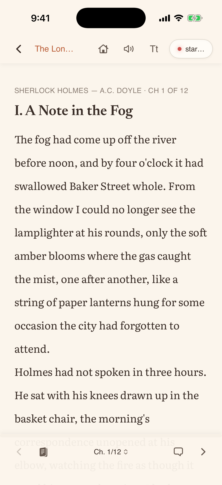
&nbsp;&nbsp;
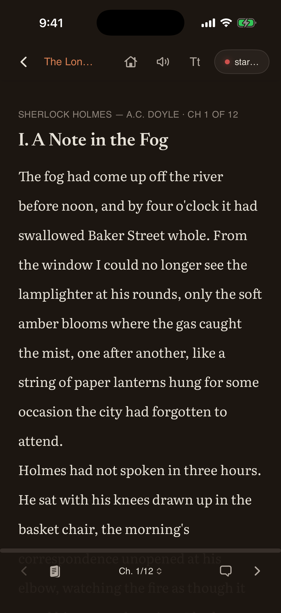
</p>

## Work Details

Full metadata, stats, tags, and chapter navigation. Bookmark works, download for offline reading, and track your progress across sessions.

<p align="center">
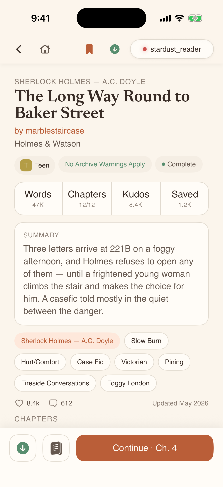
&nbsp;&nbsp;
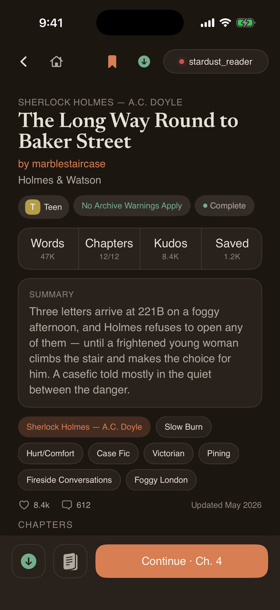
</p>

## Browse and Search

Browse the latest works on AO3 with filtering by rating, completion status, and sort order. Advanced search covers title, author, fandom, rating, and more.

<p align="center">
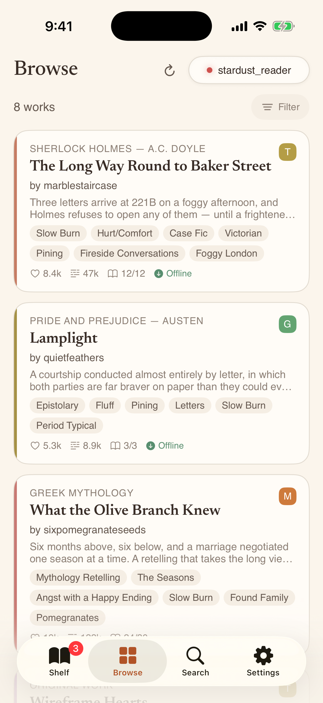
&nbsp;&nbsp;
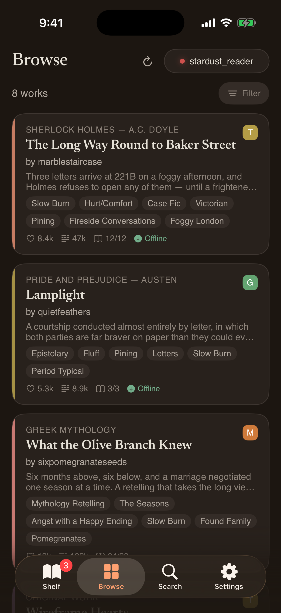
</p>

<p align="center">
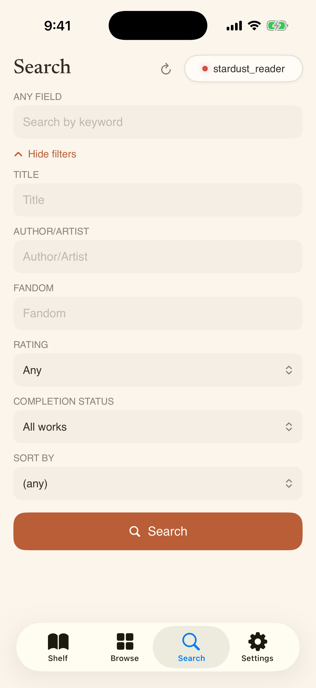
&nbsp;&nbsp;
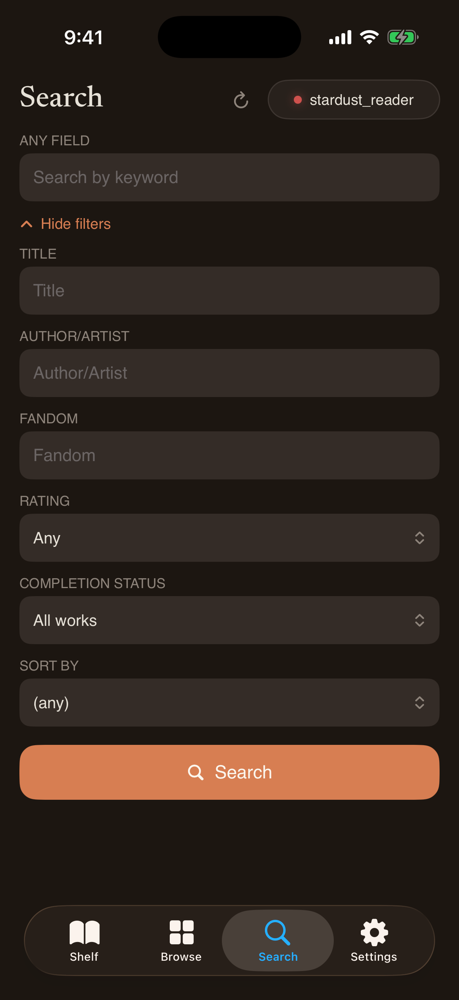
</p>

## Community

Read and reply to comment threads. Manage AO3 subscriptions across authors, works, and series.

<p align="center">
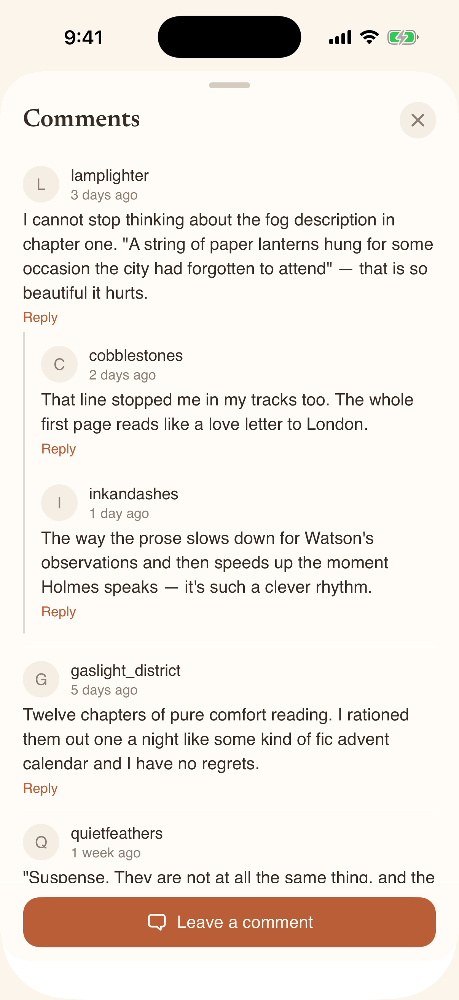
&nbsp;&nbsp;
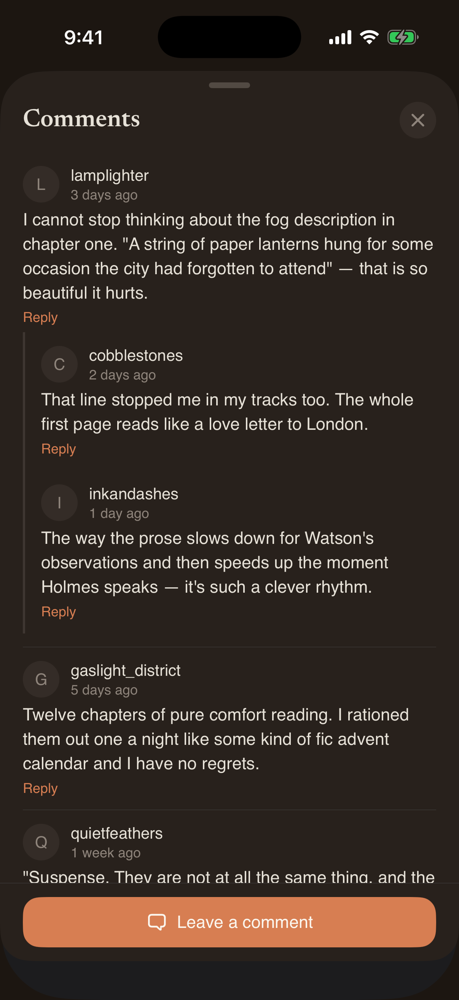
</p>

<p align="center">
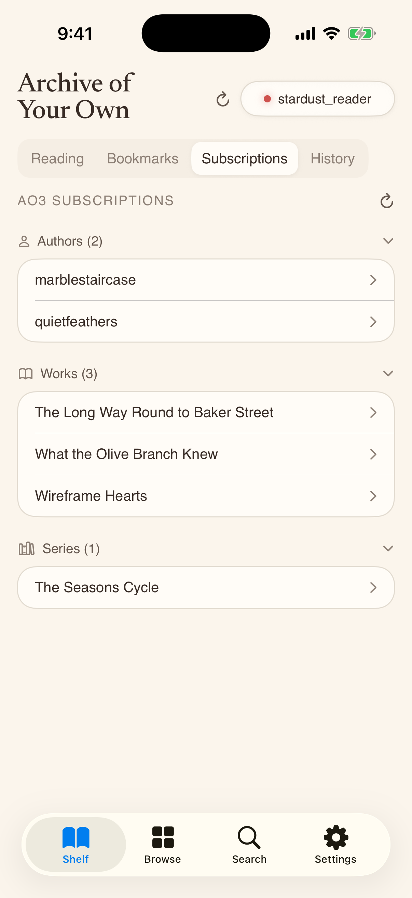
&nbsp;&nbsp;
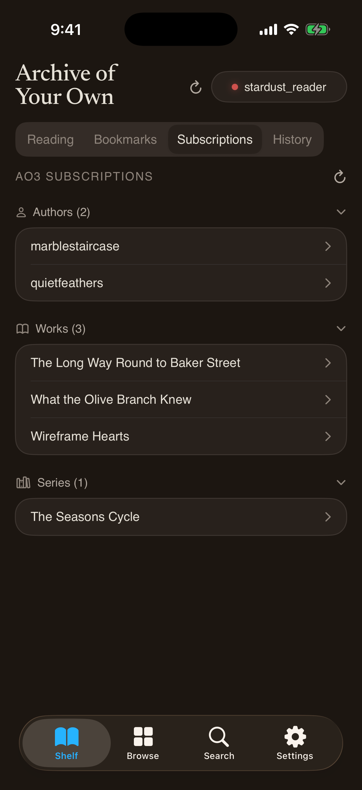
</p>

## Privacy

All network traffic routes through an embedded Tor client (pure Rust, no system proxy). The local database is encrypted with SQLCipher. Connection status and account management are accessible from any screen.

<p align="center">
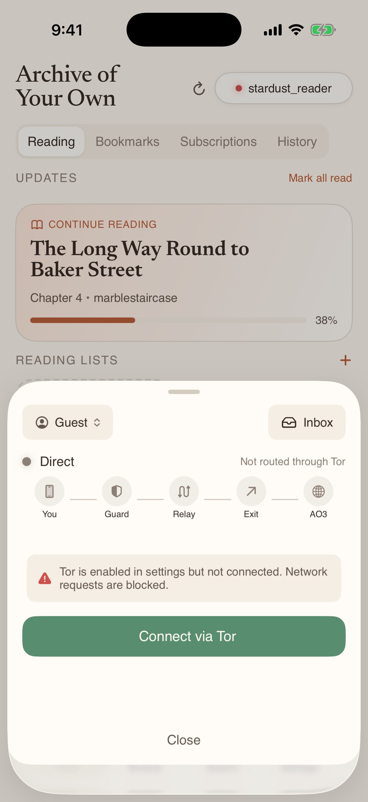
&nbsp;&nbsp;
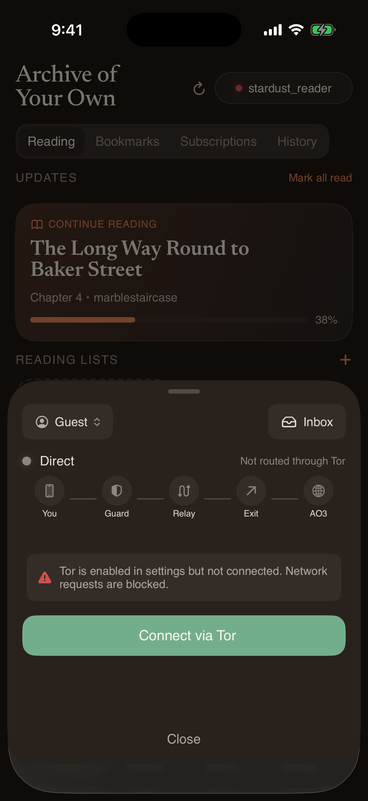
</p>

## Architecture

```
SwiftUI  -->  UniFFI bridge  -->  Rust core
  UI only      auto-generated      Tor, parsing, storage, all logic
```

- **No HTML in the UI layer.** AO3 pages are parsed in Rust into `ContentBlock` / `InlineContent` enum trees and rendered as native `Text` views.
- **No third-party Swift dependencies.** The entire dependency surface is in Rust, auditable in one place.
- **All persistent state lives in Rust.** SwiftUI is a thin, stateless shell.

### Key dependencies (Rust)

| Crate | Purpose |
|-------|---------|
| `arti-client` | Embedded Tor client (pure Rust) |
| `scraper` | HTML parsing with CSS selectors |
| `rusqlite` + `bundled-sqlcipher` | Encrypted local storage |
| `uniffi` | FFI binding generation for Swift |
| `tokio` | Async runtime |

## Building

Requires Xcode 16+, Rust toolchain, and iOS simulator or device.

```bash
# One-time: add iOS targets
rustup target add aarch64-apple-ios aarch64-apple-ios-sim

# Build Rust + generate bindings + create XCFramework
./scripts/build-rust.sh --release

# Open in Xcode
open ArchiveOfYourOwn.xcodeproj
```

## Requirements

- iOS 18.0+
- iPhone or iPad

## License

This project is not affiliated with the Organization for Transformative Works or Archive of Our Own.
